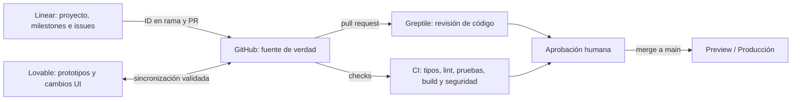

# ROCA TAX — Plan maestro y hoja de ruta

> **Documento de referencia.** La fuente vigente de alcance y decisiones es `ROCA_TAX_MASTER_PLAN_0_100.md`.

## 1. Resultado buscado

Construir una plataforma de marca sobria, editorial y confiable con dos experiencias:

1. **Sitio público sin cuenta:** presenta el legado, el oficio, el portafolio, los servicios y las piezas disponibles; convierte visitas en solicitudes de cotización o contacto.
2. **Consola administrativa protegida:** permite que personal no técnico actualice contenido, productos, galería, PDFs y catálogos mediante pasos guiados, vista previa, publicación y recuperación.

El objetivo no es trasladar el HTML a React tal cual. El HTML es inventario de contenido y referencia inicial; la nueva experiencia debe resolver navegación, edición, seguridad y calidad de marca.

## 2. Diagnóstico ejecutivo del HTML

### Conservar

- Paleta base negro, olivo y hueso.
- Contraste entre tipografía editorial y tipografía funcional.
- Legado desde 1946, taller de 1,400 m², reconocimientos y oficio artesanal.
- Fotografías reales y clasificación de especies por continente.
- Contacto y cotización como conversión principal.

### Retirar o rediseñar

- Carrusel automático de cinco pantallas heroicas.
- Tres logotipos consecutivos sin función narrativa.
- Emojis, degradados-placeholder, bordes gruesos y animaciones de tarjeta repetidas.
- Mayúsculas y títulos gigantes como recurso dominante.
- Enlaces vacíos, carrito falso y formulario que no envía.
- Dependencia de rutas `/mnt/...` y del WordPress de pruebas.
- Datos incrustados en JavaScript y edición directa del código.

### Veredicto

La base tiene identidad cromática, contenido legítimo y activos potencialmente valiosos, pero técnicamente es un prototipo estático. No existe todavía un producto administrable. La elegancia debe surgir de dirección fotográfica, proporción, tipografía, silencio visual y precisión del contenido; no de más efectos.

## 3. Dirección de diseño

### Principio rector: lujo silencioso de taller y museo

- **Personalidad:** experta, artesanal, sobria, mexicana y contemporánea.
- **Composición:** márgenes amplios, retícula editorial, jerarquías contenidas, detalles de procedencia y proceso.
- **Color:** negro carbón, hueso cálido, olivo mineral; un solo acento metálico opcional, nunca degradados decorativos.
- **Tipografía:** serif editorial para momentos de marca; sans muy legible para navegación, datos y administración.
- **Fotografía:** una imagen fuerte por momento, encuadres consistentes, sin collages genéricos ni imágenes generadas que suplanten trabajo real.
- **Movimiento:** sutil y funcional; sin carrusel automático, saltos de tarjetas ni animación ornamental constante.
- **Contenido:** lenguaje preciso, menos superlativos repetidos, más prueba: proceso, materiales, experiencia, dimensiones, disponibilidad y reconocimientos.

Antes de implementar se producirán tres direcciones visuales basadas en los activos reales y se elegirá una. No se codificará una nueva estética sin aprobar ese blanco visual.

## 4. Arquitectura de información pública

### Navegación principal

- Inicio
- El taller
- Portafolio
- Servicios
- Piezas disponibles
- Contacto / Cotizar

### Inicio

- Hero estático con una promesa y una acción principal.
- Prueba de autoridad: desde 1946, 1,400 m², capacidad y reconocimientos.
- Selección curada de trabajos, no las 37 especies completas de golpe.
- Proceso en 3–4 pasos.
- Servicios principales.
- CTA de cotización por WhatsApp/formulario.

### Portafolio

- Filtros por continente, especie, tipo de montaje y disponibilidad.
- Ficha individual con fotografías, especie, técnica, año/proyecto y notas autorizadas.
- Sin precio ni venta salvo que el registro sea producto público.

### Servicios

- Tipos de servicio y proceso.
- Preguntas frecuentes y requisitos de cotización.
- Formulario real con consentimiento y confirmación.

### Piezas disponibles

- Catálogo con inventario, precio o "solicitar precio", dimensiones, estado, envío y CTA.
- El carrito se pospone hasta confirmar que habrá venta en línea. Para MVP, cotización/reserva evita fingir e-commerce.

## 5. Consola administrativa

### Inicio del panel

Mostrar sólo cinco acciones grandes:

- Cambiar portada
- Agregar trabajo al portafolio
- Actualizar pieza o precio
- Crear catálogo PDF
- Revisar cambios pendientes

Debajo: estado del sitio, última publicación, borradores y alertas simples.

### Editor de contenido seguro

- Campos nombrados según el negocio, no según desarrollo.
- Plantillas fijas por tipo de página.
- Límites de caracteres y recorte de imagen guiado.
- Autoguardado y estado visible: Borrador / Listo para revisar / Publicado.
- Vista previa idéntica a escritorio y móvil.
- Publicación con resumen concreto: “Cambiarás portada, teléfono y 2 precios”.
- Deshacer publicación y restaurar versión anterior.

### Biblioteca privada

- Búsqueda por título, autor/proveedor, tema, especie, país, año, palabras clave y texto extraído.
- Vista de metadatos y archivo con permisos.
- Etiquetas controladas, no sólo texto libre.
- Los resultados privados nunca se mezclan con búsquedas públicas.
- Registro de quién consultó, descargó o modificó documentos sensibles cuando aplique.

### Estudio de PDFs y catálogos

Flujo recomendado:

1. Subir original.
2. Nombrar y clasificar.
3. Elegir operación: reordenar, quitar, insertar, portada, datos/precios.
4. Previsualizar todas las páginas afectadas.
5. Guardar como nueva versión.
6. Aprobar/publicar o descargar.

Nunca sobrescribir el original. Para catálogos, el administrador selecciona productos y una plantilla; el sistema genera el PDF con precios vigentes y fecha de versión.

### Permisos mínimos

- **Propietario:** usuarios, permisos, publicación y configuración.
- **Administrador:** contenido, productos, biblioteca y documentos; puede publicar.
- **Editor:** crea borradores y previsualiza; no publica ni elimina originales.

## 6. Arquitectura técnica recomendada

- **Frontend:** React + TypeScript con un sistema de componentes documentado. Mantener compatibilidad con el flujo de Lovable y evitar bifurcaciones de stack.
- **Backend y datos:** Postgres con API protegida; autenticación sólo para `/admin`.
- **Almacenamiento:** buckets separados para medios públicos, originales privados, versiones PDF y catálogos publicados.
- **Búsqueda:** Postgres full-text al inicio; extracción OCR/texto en segundo plano para documentos que lo requieran.
- **Publicación:** contenido estructurado con estados y versiones; la web pública sólo consume registros publicados.
- **Seguridad:** control de acceso a nivel de fila/objeto, URLs firmadas para archivos privados, MFA para administradores, bitácora de auditoría y respaldos.
- **PDF:** procesamiento en servidor/worker, nunca sólo en el navegador; validación de tipo, tamaño, antivirus y límites de recursos.
- **Observabilidad:** errores, eventos de publicación, fallos de carga y conversiones de cotización.

### Modelo inicial

- `users`, `roles`, `user_roles`
- `pages`, `content_blocks`, `content_versions`
- `portfolio_items`, `species`, `media_assets`
- `services`, `inquiries`
- `products`, `inventory_events`, `price_versions`
- `library_records`, `private_documents`, `document_tags`
- `pdf_sources`, `pdf_versions`, `catalogs`, `catalog_items`
- `audit_events`, `publish_events`

## 7. Flujo GitHub + Linear + Greptile + Lovable

### Orden de alta recomendado

1. Definir propietario GitHub, visibilidad y nombre técnico `roca-tax-pagina`.
2. Crear el proyecto en Lovable con el nombre definitivo y validar el flujo de conexión disponible.
3. Dejar que Lovable cree el repositorio si la integración vigente no admite adoptar uno existente.
4. Clonar el repo al workspace y establecer `main` protegida.
5. Ejecutar un spike y documentar si el cambio de rama de Lovable preserva PR, CI y protección de `main`.
6. Crear el proyecto Linear `ROCA TAX — Plataforma web y administración` y conectar el repositorio.
7. Instalar Greptile sólo en ese repositorio y configurar revisiones de PR.
8. Agregar CI obligatorio y revisión humana. Greptile ayuda, pero no autoriza por sí solo un merge.

### Reglas operativas

- Cada cambio parte de un issue Linear.
- Rama: `ROCA-123-descripcion-corta` o el identificador que asigne el equipo.
- Lovable no puede modificar producción sin pasar por un flujo verificado de PR, CI y revisión.
- Todo cambio de Lovable entra por PR y pasa Greptile + CI + revisión visual.
- La base de datos, permisos, PDFs y seguridad no se delegan a un prompt visual sin revisión técnica.

## 8. Roadmap por hitos

### Hito 0 — Fundaciones y activos

- Confirmar propietario, dominio, visibilidad y responsables.
- Recuperar logotipos, fotos y reconocimientos originales.
- Auditar derechos, calidad, datos de contacto y copys.
- Elegir una de tres direcciones visuales.
- Crear repo/integraciones con el orden anterior.

**Salida:** repositorio gobernado, backlog listo, inventario de activos y dirección visual aprobada.

### Hito 1 — Base técnica y sistema de diseño

- App React/TypeScript, rutas públicas y `/admin`.
- Tokens, tipografía, retícula, componentes y estados accesibles.
- Auth, roles, base de datos, storage y entornos.
- CI, previews y pruebas base.

**Salida:** esqueleto navegable, login admin y componentes aprobados.

### Hito 2 — Sitio público MVP

- Inicio, taller, portafolio, servicios, piezas y contacto.
- Formulario real + WhatsApp con datos prellenados.
- SEO, rendimiento, responsive, accesibilidad y analytics.
- Migración inicial de especies, productos y activos válidos.

**Salida:** recorrido público completo en preview y medido.

### Hito 3 — Administración sencilla

- Dashboard de acciones.
- Edición por módulos, medios, productos y portafolio.
- Borrador, preview, publicación, versiones y deshacer.
- Pruebas con administradores reales usando tareas concretas.

**Salida:** un administrador no técnico puede completar cinco tareas críticas sin ayuda.

### Hito 4 — Biblioteca privada y documentos

- Ingesta, metadatos, etiquetas, permisos y búsqueda.
- Originales privados y URLs firmadas.
- Versionado PDF y operaciones acotadas.
- Generador de catálogo desde productos y plantilla.

**Salida:** búsqueda privada funcional y catálogo PDF reproducible sin destruir fuentes.

### Hito 5 — Endurecimiento y lanzamiento

- Pruebas de seguridad, permisos, respaldos y recuperación.
- Revisión legal/comercial de catálogo, privacidad y envíos.
- Pruebas móviles, lectores de pantalla y teclado.
- Capacitación breve, manual visual y protocolo de soporte.

**Salida:** checklist de lanzamiento firmado y producción con monitoreo.

## 9. Backlog inicial para Linear

### Epic A — Descubrimiento y dirección

- Auditar activos y dependencias del HTML.
- Validar información comercial y legal.
- Generar tres direcciones visuales con activos reales.
- Probar arquitectura de contenido con 5 tareas administrativas.

### Epic B — Plataforma

- Inicializar repositorio y entornos.
- Crear sistema de diseño y rutas.
- Configurar auth, roles, storage y auditoría.
- Configurar CI, previews y observabilidad.

### Epic C — Sitio público

- Implementar Inicio y Taller.
- Implementar Portafolio y filtros.
- Implementar Servicios y cotización.
- Implementar Piezas disponibles y contacto.
- Añadir SEO, rendimiento y accesibilidad.

### Epic D — Administración

- Dashboard de tareas frecuentes.
- Editor modular con preview.
- Gestión de medios, portafolio y productos.
- Versionado, publicación y restauración.

### Epic E — Biblioteca y PDFs

- Modelo y búsqueda de biblioteca.
- Ingesta privada y permisos.
- Versionado y operaciones PDF.
- Generador de catálogo y exportación.

### Epic F — Lanzamiento

- QA visual y funcional.
- Pruebas con administradores.
- Seguridad, backups y recuperación.
- Capacitación y salida a producción.

## 10. Criterios de éxito

- El sitio público funciona completo sin registro.
- Una cotización llega con trazabilidad y confirmación para el cliente.
- Un administrador cambia portada, precio y publicación sin tocar código.
- Ningún original PDF se sobrescribe y toda publicación puede revertirse.
- Un archivo privado no es accesible sin permiso ni URL firmada vigente.
- Las cinco tareas administrativas críticas alcanzan al menos 90% de éxito en pruebas moderadas.
- Lighthouse y pruebas manuales cumplen los presupuestos acordados de rendimiento y accesibilidad.
- `main` no recibe cambios sin PR, CI y revisión.

## 11. Lo que no entra en el MVP

- Editor libre de layouts, colores o tipografías.
- Edición de PDF equivalente a Acrobat.
- Marketplace completo, pagos y logística internacional sin definición comercial/legal.
- Búsqueda semántica avanzada antes de validar que la búsqueda textual y los metadatos no bastan.
- Automatizaciones de IA que publiquen sin aprobación humana.

## 12. Puerta para comenzar ejecución

Antes de crear servicios externos hay que confirmar tres datos: cuenta u organización propietaria de GitHub, visibilidad inicial del repositorio y si ya existe un workspace/proyecto Lovable que deba conservarse. Con eso se ejecuta el Hito 0 sin duplicar repositorios ni romper sincronización.
